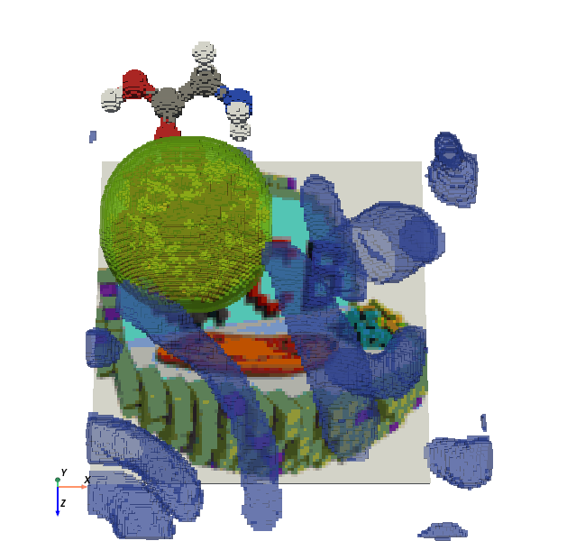

**mcschematic-plus** is a library that extends the functionality of [mcschematic](https://github.com/Sloimayyy/mcschematic) for creating Minecraft schematics (.schem) and structures (.nbt) from ndarray, image or 3D model data.

# Installing
Clone this repository into a local directory.
```sh
git clone https://github.com/facetorched/mcschematic-plus.git
```
Navagate into the repository and install the package locally. Optionally making it editable by including the `-e` flag.
```sh
pip install -e .
```

# Usage
The class `MCSchematicPlus` offers the main functionality of the package and is a drop-in replacement for `MCSchematic`.

```python
from mcschematic_plus import MCSchematicPlus, read_tiff, read_mesh, read_image

schem = MCSchematicPlus()

# Load 3D data from a multipage tiff
schem.placeVolume(read_tiff("tests/data/blobs.tiff"), "minecraft:blue_stained_glass")

# Load blocks from an existing schematic file
schem.placeSchematic(MCSchematicPlus("tests/data/min_cell.schem"))

# Load a 3D model
voxels, position, scalars = read_mesh("tests/data/glycine.glb", spacing=0.1, edge_mode="inner", compute_scalars=True)
colors = (scalars * 255).astype(int)
schem.placeVolume(voxels, colors, blockColormap="standard", placePosition=position)

# Load 2D RGB image
image = read_image("tests/data/qcb.png")
mask = image.sum(axis=-1).astype(bool)
schem.placeVolume(mask, image, blockColormap="standard")

# Visualize the schematic
pl = schem.show(display=False)
pl.camera.zoom(1.3)
pl.camera.elevation = 75
pl.show()

# Save both a schematic and nbt file
schem.save("output/example")
schem.saveNBT("output/example", origin=None)

# Split the cell schematic by block type and save individual schematic and nbt files
component_map = {
    "minecraft:lime_stained_glass": "membrane",
    "minecraft:red_wool": "dna",
    "minecraft:yellow_wool": "ribosome"
}
cell_schem = MCSchematicPlus("tests/data/min_cell.schem")
origin = cell_schem.getBounds()[0] # Consistent origin for all NBT files
split = cell_schem.splitByBlock()
for namespaced_name, block_schem in split.items():
    component_name = component_map.get(namespaced_name, namespaced_name)
    block_schem.saveNBT(f"output/cell_{component_name}", origin=origin)
    block_schem.save(f"output/cell_{component_name}")
```
